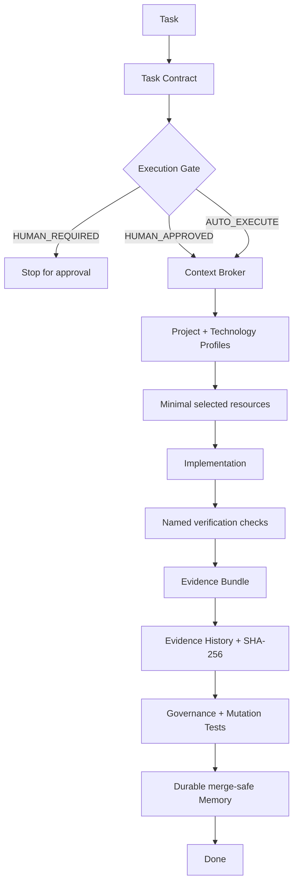
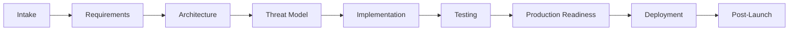
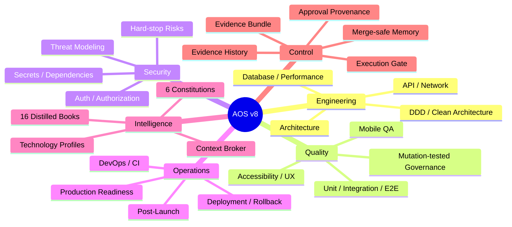
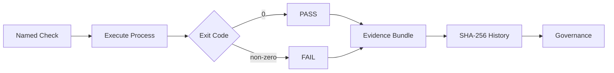

<p align="center">
  <h1 align="center">🤖 AOS — Agent Operating System</h1>
  <p align="center">
    <strong>v8.0.0-rc.1</strong> · Governed execution for AI coding agents<br>
    Language-Agnostic · Framework-Agnostic · Editor-Agnostic
  </p>
</p>

<p align="center">
  
  
  
  
  
  
</p>

<p align="center">
  <strong>Architecture · Security · Testing · DevOps · UX · Performance · Memory · Evidence · Governance</strong>
</p>

---

# What AOS gives you

AOS turns an AI coding agent from “a model that edits files” into a governed engineering worker with explicit context, risk, approval, verification, memory, and release discipline.

| Capability | What AOS provides | Where it lives |
|---|---|---|
| 🏗️ **Architecture** | ADRs, architecture review, DDD/Clean Architecture guidance when applicable, profile-scoped patterns | `.agent/04-memory/decisions.md`, `.agent/02-rules/` |
| 🔐 **Security** | Threat modeling, auth/authorization review, hard-stop risks, security gates, secret/dependency checks | `.agent/02-rules/security-checklist.md`, `.agent/03-workflows/security-gate/` |
| 🧪 **Testing & QA** | Unit/integration/E2E strategy, quality gates, mutation-tested governance | `.agent/03-workflows/qa-strategy.md`, `.agent/governance/` |
| 🚀 **DevOps & Deployment** | CI validation, production readiness, deployment, rollback, post-launch checks | `.agent/03-workflows/master-pipeline/` |
| 📈 **Reliability & Observability** | Resilience, health/readiness, logging/tracing, production-readiness review | `.agent/02-rules/testing-and-quality.md`, production-readiness workflow |
| ⚡ **Database & Performance** | Query/index guidance, bounded result handling, performance-aware access patterns | `.agent/02-rules/database-performance.md` |
| 🌐 **API & Network** | API contracts, payload design, latency/chatty-call review, versioning guidance | `.agent/02-rules/network-and-api.md` |
| 🎨 **Frontend & UX** | UX review, accessibility, responsive behavior, frontend workflow guidance | `.agent/03-workflows/create-frontend-module.md`, UX workflow |
| 📱 **Mobile QA** | Environment discovery, build verification, scenarios, evidence reporting | `.agent/03-workflows/mobile-qa/` |
| 🧠 **Memory & Learning** | Project context, decisions, learned mistakes, durable patterns, merge-safe handoff | `.agent/04-memory/` |
| 🤖 **Autonomous Execution** | `AUTO_EXECUTE`, `HUMAN_APPROVED`, `HUMAN_REQUIRED` modes | Execution Gate + Approval Engine |
| 🎯 **Context Control** | Context Broker selects only relevant rules/workflows/references | `context_broker.py`, `context-map.json` |
| 🧾 **Executable Evidence** | Named checks, PASS/FAIL from exit code, SHA-256 Evidence History | `evidence_recorder.py`, `.agent/evidence/` |
| 🛡️ **Governance** | 41 checks + 28 mutation tests proving checks can fail | `.agent/governance/` |
| 📚 **Engineering Knowledge** | 16 distilled books, 6 constitutions, REF/OPS/QA catalogs, prompts/templates | `.agent/05-references/`, `.agent/06-templates/` |

> **Important:** this README is the complete user-facing overview. It is **not** a second runtime authority. Executable truth remains in `boot-manifest.md`, Task Contract, Execution Gate, Context Map, Profiles, and Project Profile.

---

# How AOS works



The agent does not load everything. It declares the task, resolves approval, selects the smallest relevant context, executes, verifies, records evidence, and only then completes the task.

---

# From install to Done

```mermaid
flowchart LR
    A[1. Install AOS] --> B[2. Initialize target project]
    B --> C[3. Discover stack + architecture]
    C --> D[4. Create Project Profile]
    D --> E[5. Give the agent a task]
    E --> F[6. Execution Gate]
    F --> G[7. Context Broker]
    G --> H[8. Implement]
    H --> I[9. Verify + Evidence]
    I --> J[10. Governance]
    J --> K[11. Memory update]
    K --> L[12. Done]
```



## 1) Install the sanitized runtime

From the AOS repository:

```bash
python .agent/install.py /path/to/your-project
```

The installer copies reusable runtime assets and deliberately excludes source-project state:

- `.agent/04-memory/`
- `.agent/profiles/project.json`
- `.agent/task-contracts/current.json`
- `.agent/evidence/current.json`
- `.agent/evidence/history/`

This prevents a new project from inheriting AOS's own identity, approvals, task, or history.

## 2) Initialize the target project

Open the target repository and tell your AI tool:

```text
Run .agent/03-workflows/init-project.md for this repository.
Discover the project and create target-specific memory, Project Profile,
Task Contract, and verification commands.
After initialization, follow .agent/01-core/boot-manifest.md exactly.
```

The initialization workflow discovers the actual stack, architecture, tests, commands, CI, and conventions before enabling full governance.

## 3) Work normally

For non-trivial work, AOS maintains `.agent/task-contracts/current.json` and runs:

```bash
python .agent/01-core/execution_gate.py
```

The result is one of:

| Mode | Meaning |
|---|---|
| 🟢 `AUTO_EXECUTE` | Existing verified policy/ADR/pattern covers the task |
| 🟡 `HUMAN_APPROVED` | Explicit Navigator approval covers the task |
| 🔴 `HUMAN_REQUIRED` | Stop before implementation |

---

# Engineering lifecycle

For full lifecycle work AOS provides nine stages:



| Stage | Typical focus |
|---|---|
| **0 — Intake** | Scope, classification, risks, affected areas |
| **1 — Requirements** | Acceptance criteria, ambiguity removal, SDD |
| **2 — Architecture** | Boundaries, decisions, ADRs, trade-offs |
| **3 — Threat Model** | Security boundaries, abuse cases, data risk |
| **4 — Implementation** | Existing project patterns + selected rules |
| **5 — Testing** | Unit/integration/E2E/static/security checks as applicable |
| **6 — Production Readiness** | Reliability, observability, recovery, operations |
| **7 — Deployment** | Rollout, rollback, smoke checks |
| **8 — Post-Launch** | Health, incidents, DORA/user impact, retrospective |

Pipeline depth is proportional to task risk. AOS does not force every task through every stage.

---

# Capability map



---

# Core runtime

| File | Role |
|---|---|
| `.agent/01-core/boot-manifest.md` | Canonical runtime contract |
| `.agent/01-core/task_contract.py` | Validates structured task contracts |
| `.agent/01-core/execution_gate.py` | Unified pre-execution decision |
| `.agent/01-core/approval_engine.py` | Approval provenance + hard-stop policy |
| `.agent/01-core/approval-policy.json` | Executable approval rules |
| `.agent/01-core/approval-registry.json` | Verified ADR/pattern approval sources |
| `.agent/01-core/context_broker.py` | Deterministic context resolver |
| `.agent/01-core/context-map.json` | Executable capability → resource map |
| `.agent/01-core/evidence_recorder.py` | Runs named checks + records Evidence |
| `.agent/profiles/project.json` | Project-specific stack, commands, affected-area routing |
| `.agent/profiles/technology/` | Optional Technology Profiles |

---

# Task Contract

A non-trivial task records its execution contract in:

`.agent/task-contracts/current.json`

Typical fields:

```json
{
  "task_id": "T000",
  "classification": "medium",
  "capabilities": ["testing"],
  "affected_areas": ["src/feature"],
  "risk": {
    "security_boundary": false,
    "data_migration": false
  },
  "approval": {
    "status": "approved",
    "provenance": "approved_pattern",
    "reference": "pattern-id"
  },
  "verification": ["build", "test"]
}
```

Unknown risks, invalid provenance, invalid affected areas, and missing named checks are rejected by executable validation.

---

# Context Broker

Context selection comes from three sources:

```text
Explicit capabilities
       +
Risk-derived capabilities
       +
Affected-area-derived capabilities
       ↓
Context Broker
       ↓
Minimal relevant resources
```

Examples:

| Input | Derived context |
|---|---|
| `security_boundary=true` | Security + Testing |
| `data_migration=true` | Database + Testing |
| `production_change=true` | Production Readiness + Deployment + Testing |
| `.github/workflows/**` | Deployment + Testing |

Technology-specific guidance loads only when its Technology Profile is active.

---

# Security model

AOS treats security as an engineering boundary, not a final checklist.

It can route tasks into:

- threat modeling,
- auth/authz review,
- IDOR/access-control analysis,
- injection/XSS input boundaries,
- secret scanning,
- dependency checks,
- security-focused code review,
- test verification,
- security gate reporting.

Hard-stop risks such as destructive changes, security boundaries, data migrations, production changes, or breaking contracts cannot silently self-approve.

---

# Testing, QA & evidence

AOS separates **claims** from **evidence**.

Named verification commands come from the Project Profile and run through:

```bash
python .agent/01-core/evidence_recorder.py --check governance_compile
python .agent/01-core/evidence_recorder.py --check governance_verify
```

Rules:

- arbitrary undeclared commands are rejected,
- commands run shell-free,
- PASS/FAIL is derived from exit code,
- current evidence is stored in `.agent/evidence/current.json`,
- completed evidence can be archived with SHA-256 integrity,
- CI can upload Evidence History,
- tampering with archived evidence is detected.



---

# DevOps, production & release discipline

AOS includes workflows for:

- CI verification,
- production readiness,
- deployment strategy,
- rollback planning,
- smoke checks,
- observability/readiness,
- post-launch monitoring,
- evidence artifacts,
- release version consistency.

For AOS itself, GitHub Actions verifies pull requests and `main`, and release consistency is protected by governance.

---

# Memory that learns without becoming stale

Canonical SDD lifecycle:

```text
Draft → Clarify → Approved → Planning → Ready → Executing → Validating → Done
```

Memory files:

| File | Purpose |
|---|---|
| `project-context.md` | Durable current engineering state |
| `active-tasks.md` | Current task + ordered SDD state |
| `learned-mistakes.md` | Active lessons that should not repeat |
| `decisions.md` | ADR log |
| `project-knowledge.md` | Verified durable project patterns |
| `codebase-map.md` | Discovered project structure |

Boot Memory is merge-safe: current branch, PR status, mergeability, and queued CI are queried live instead of being persisted as durable truth.

---

# Knowledge system

AOS includes:

- **16 distilled engineering books**
- **6 constitutions**
- REF / OPS / QA catalogs
- specialized rules
- workflows
- templates and prompts

Knowledge is loaded **on demand**, not as a giant prompt.

```text
Task Contract
  ↓
Execution Gate
  ↓
Context Broker
  ↓
only the relevant rule / workflow / reference anchors
```

This keeps context focused while retaining access to deeper engineering knowledge.

---

# Governance strength

Full verification:

```bash
python .agent/governance/verify.py
```

Current RC baseline:

- **41 governance checks**
- **28/28 mutation violations detected**
- **Boot Context hard gate: ≤150 lines**
- Evidence Bundle verified
- Evidence History verified
- sanitized installation behaviorally tested
- README capability coverage governed
- version consistency governed

Mutation tests deliberately break the operating system and prove the relevant governance check catches the violation.

---

# Project structure

```text
.agent/
├── 01-core/                  # execution, approval, context, evidence
├── 02-rules/                 # architecture/security/DB/API/testing rules
├── 03-workflows/             # features, QA, security, pipeline, deployment
│   ├── master-pipeline/
│   ├── mobile-qa/
│   └── security-gate/
├── 04-memory/                # context, ADRs, mistakes, project knowledge
├── 05-references/            # books, constitutions, reference catalogs
├── 06-templates/             # engineering templates
├── profiles/
│   ├── project.json
│   └── technology/
├── task-contracts/
│   └── current.json
├── evidence/
│   ├── README.md
│   └── history/
└── governance/
    ├── runner.py
    ├── verify.py
    ├── test_state.py
    ├── test_rules.py
    ├── test_memory.py
    ├── test_context.py
    ├── test_execution.py
    └── test_mutations.py
```

---

# Source of truth

README tells you **what AOS is, what it can do, and how to use it**.

Executable authority remains here:

| Question | Source of truth |
|---|---|
| How should the agent operate? | `boot-manifest.md` |
| What is this task? | `task-contracts/current.json` |
| May the agent proceed? | `execution_gate.py` + approval policy/registry |
| What context should load? | `context-map.json` + Context Broker |
| What stack/project rules apply? | Project + Technology Profiles |
| What actually passed? | Evidence Bundle/History |
| Is AOS internally consistent? | Governance + mutation verification |

This boundary lets README stay rich and friendly without duplicating executable policy.

---

# Architecture decisions

Current v8 direction:

- ADR-006 — Vertical Slice → optional Technology Profile
- ADR-007 — resources/references → on-demand
- ADR-008 — deterministic Context Broker
- ADR-009 — Approval Engine + executable Evidence Bundle
- ADR-010 — verified provenance + Execution Gate + Evidence History
- ADR-011 — risk/affected-area capability routing
- ADR-012 — merge-safe durable Boot Memory
- ADR-013 — sanitized two-phase consumer installation
- ADR-014 — README as complete user-facing capability map

---

# Contributing

Before submitting a non-trivial AOS change:

```bash
python .agent/01-core/execution_gate.py
python .agent/01-core/evidence_recorder.py --check governance_compile
python .agent/01-core/evidence_recorder.py --check governance_verify
```

Use a branch/PR for AOS self-development. Merge only after final CI and completed-state verification are green.

---

# License

MIT License — see [LICENSE](LICENSE).

---

<p align="center">
  <strong>AOS v8.0.0-rc.1</strong><br>
  Deterministic context · Verified approvals · Executable evidence · Mutation-tested governance
</p>
