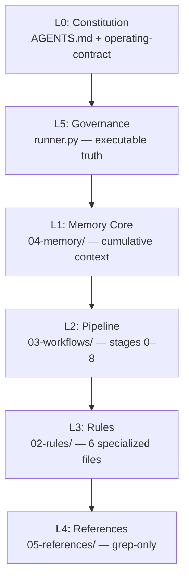

<p align="center">
  
  
  
</p>

<h1 align="center">🧠 AOS — Agent Operating System</h1>

<p align="center">
  <strong>Turn any AI coding assistant into a governed engineering team.</strong><br/>
  <em>Knowledge-first. Memory-first. Every task classified. Every delivery verified.</em>
</p>

<p align="center">
  <a href="#-quick-start">Quick Start</a> •
  <a href="#-how-it-works">How It Works</a> •
  <a href="#-architecture">Architecture</a> •
  <a href="#-reference-library">References</a> •
  <a href="#-faq">FAQ</a>
</p>

---

## 💡 What is AOS?

AOS (Agent Operating System) is a **stack-agnostic framework** that transforms any AI coding assistant into a **governed engineering team**. It solves the fundamental problem: *AI models know good practice but never apply it consistently.*

| The Problem | AOS Solution |
|---|---|
| Knowledge scattered across chats | **Wiring Registry** — one DI container mapping capabilities → rules → references |
| 16 books of wisdom, zero enforcement | **6 constitutions (79 rules)** + **34 REF directives** + **114-lesson archive** |
| Context dies between sessions | **Cumulative memory** — resume mid-sentence in any tool |
| "Done" = "it compiles" | **Vertical-slice governance** — 7 layers covered or justified |
| Contradicting guidance | **Layer priority L0→L5** — Security > Memory > Correctness |

---

## 🚀 Quick Start

```bash
# 1. Clone the master (read-only source)
git clone https://github.com/Nezarabdluah/My-Programming-Workflow.git

# 2. Copy .agent/ into YOUR project
cp -r My-Programming-Workflow/.agent/ your-project/.agent/

# 3. Paste the session prompt as your first AI message
# (see: The Session Prompt section below)
```

> ✅ The agent prints a **boot report** (proof it read memory) and asks for the first task.

---

## 🔄 How It Works

### Task Classification

Every task is automatically triaged:

| Mode | Signals | Process |
|------|---------|---------|
| 🟢 **Simple** | typo, color, comment (≤2 files) | Execute immediately + summary |
| 🟡 **Medium** | business logic, multi-file | SDD spec → approval → tests green |
| 🔴 **Sensitive** | DB, auth, architecture (>5 files) | ADR + OWASP + human gate |

### The 7-Step Flow

```
Boot → Classify → Route → Inject Resources → Implement → Govern → Close
```

1. **Boot** — Agent reads memory, prints proof report
2. **Classify** — Task triaged as 🟢/🟡/🔴
3. **Route** — Takes exactly one path (A/B/C/D)
4. **Inject** — Load rules, constitutions, references (mandatory)
5. **Implement** — Code written against approved plan only
6. **Govern** — `runner.py` runs deterministic checks
7. **Close** — Delivery report + memory saved

### Task Paths

| Path | When | What Happens |
|------|------|--------------|
| **A** — Feature | new functionality | SDD spec → approval → plan → implement |
| **B** — Known type | backend, frontend, bug, security | Follow matching workflow |
| **C** — Trivial | typo, color, comment | Done immediately |
| **D** — Full delivery | production-grade | Pipeline stages 0–8 |

---

## 🏗️ Architecture

Six layers, one direction, zero ambiguity:



| Layer | Contains | Authority |
|-------|----------|-----------|
| **L0** Constitution | `AGENTS.md` + operating contract | ⬆️ Highest — wins every conflict |
| **L5** Governance | `runner.py` — executable checks | Overrides any model claim |
| **L1** Memory | `04-memory/` — cumulative context | Single source of truth |
| **L2** Pipeline | `03-workflows/` — stages 0–8 | Consumable, loaded per task |
| **L3** Rules | `02-rules/` — 6 files | One file at a time, never two |
| **L4** References | `05-references/` — books, REF, QA | ⬇️ Grep-only, never full-read |

> Dependency flow is **strictly one-way**: Workflows → Memory → References → Rules.

---

## 📁 Repository Structure

```
.agent/
├── AGENTS.md                  # Master directive contract
├── INDEX.md                   # Smart index — reach any file
├── VERSION                    # Version + sync info
├── 01-core/                   # Core (mandatory at session start)
│   ├── operating-contract.md  #   Operational contract
│   ├── session-prompt.md      #   Unified session prompt
│   ├── task-classification.md #   🟢/🟡/🔴 indicators
│   ├── token-budget.md        #   ≤400 lines/session policy
│   └── wiring-registry.md     #   ⭐ Central DI container
├── 02-rules/                  # Specialized rules (ONE at a time)
│   ├── architecture-and-design.md
│   ├── database-performance.md
│   ├── security-checklist.md
│   ├── testing-and-quality.md
│   ├── network-and-api.md
│   └── vertical-slice-governance.md
├── 03-workflows/              # Workflows (Markdown-driven)
│   ├── master-pipeline/       #   ⭐ Stages 0–8
│   ├── security-gate/         #   Security gate (7 steps)
│   └── mobile-qa/             #   Mobile QA
├── 04-memory/                 # Cumulative contextual memory
│   ├── project-context.md
│   ├── active-tasks.md
│   ├── decisions.md
│   └── learned-mistakes.md
├── 05-references/             # References (grep-only)
│   ├── engineering-rules-catalog-REF.md
│   ├── books/
│   │   ├── 00-master-index.md #   ⭐ Resource Injection Matrix
│   │   └── constitutions/     #   6 constitutions (79 rules)
│   └── prompts/
├── 06-templates/              # Project templates
│   └── dotnet-abp/            #   ABP/.NET specific
├── governance/                # Deterministic enforcement
│   ├── runner.py
│   └── test_*.py
└── adr/                       # Architecture Decision Records
```

---

## 📚 Reference Library

| Resource | Description |
|----------|-------------|
| **REF Catalog** | 34 directives: ARCH×7, DB×7, SEC×5, NET×5, TEST×2, OBS×2, RES×1, AI×1 |
| **Constitutions** | 79 actionable rules from 16 engineering books |
| **Books Archive** | 114 lessons — grep `Lesson N` for deep rationale |
| **Prompt Packs** | backend / frontend / debugging |
| **QA / DevOps** | 11 `[QA-*]` anchors · 18 `[OPS-*]` anchors |

---

## 🛡️ Governance Gate

```bash
python .agent/governance/runner.py
```

**10 deterministic checks** — executable ground truth, not model claims.

| Enforcement Level | Tag | Confidence |
|-------------------|-----|------------|
| CI pipeline ran | `[Enforcement: CI ✅]` | Highest |
| Git hooks fired | `[Enforcement: hooks ⚠️]` | Good |
| runner.py executed | `[Enforcement: runner.py 🔶]` | Acceptable |
| Manual checklist | `[Enforcement: manual 🔶]` | Lowest acceptable |
| Model claim only | `[Enforcement: claim ❌]` | **REJECTED** |

---

## 🔀 Switching AI Tools

1. Say **"switch tool"** — memory updates, handoff summary prints
2. In the new tool, paste the session prompt + handoff summary
3. Work resumes at the exact stopping point

---

## 📋 Session Prompt

<details>
<summary><b>Click to expand the full session prompt</b></summary>

```text
You operate on an integrated system: AOS v7.0 + Spec-Kit (SDD) — Knowledge-first & Memory-first Platform.
Communicate in clear, professional English. Think aloud in a structured, rigorous way before every decision.
Main AOS source (READ-ONLY): [YOUR-LOCAL-AOS-PATH]

SOURCE PROTECTION: never modify or write to the Main AOS Path. All writes happen in the current project's local .agent/04-memory/ only.

STEP 0 — BOOT & MATCH (silent, then report):
1. If the current project has no .agent/ folder → initialize it by fully executing [YOUR-LOCAL-AOS-PATH]/03-workflows/init-project.md
2. If .agent/ exists → diff 01-core/, 02-rules/, 03-workflows/, 04-memory/, 05-references/, governance/ against the main source; copy any missing file
3. If the project already contains code → also execute .agent/03-workflows/knowledge-bootstrapping.md

SESSION MODE (budget ≤ 400 lines). Read in order:
1. .agent/INDEX.md  2. .agent/01-core/operating-contract.md  3. .agent/04-memory/project-context.md
4. .agent/04-memory/learned-mistakes.md  5. .agent/04-memory/active-tasks.md  6. .agent/VERSION

Then print this boot report:
  Session started | System: AOS v7.0 (Knowledge & Memory-first)
  Project: [name] | Stack: [detected]
  Memory — project-context: "[last task verbatim or 'new project']"
  Memory — learned-mistakes: [N] active, latest: "[quote or 'none']"
  Memory — active-tasks: [N] pending, top: "[quote or 'none']"
  VERSION: [in sync ✅ / needs sync ⚠️]
  Ready — what is our next task?

TASK ROUTING:
- Path A (new feature) → SDD: Draft → Clarify → Approved → Planning → Ready → Executing → Validating → Done
- Path B (known type) → follow matching workflow file
- Path C (trivial) → do it, summarize
- Path D (full delivery) → master-pipeline stages 0–8

SMART WIRING (before code): resolve via wiring-registry.md + 00-master-index.md; load ONE 02-rules/ file; grep 05-references/; cite // [REF-XX-N] and // [CONST-XX-N]

HANDOFF: update memory files, print handoff summary
CLOSEOUT: execute end-session.md, update all memory, print summary

FORBIDDEN: writing to main AOS source · loading two rule files at once · full-reading 05-references/ · skipping classification · coding 🟡/🔴 without approved spec+plan · ending without updating memory
```

</details>

---

## ❓ FAQ

**Which AI tools work?**
Any assistant reading local files: Claude, Cursor, Windsurf, Copilot, and more. Shims (`.cursorrules`, `.windsurfrules`) point them at `.agent/`; root `AGENTS.md` is auto-discovered by ~30 tools.

**Which stack?**
None forced. Only `06-templates/` is .NET/ABP-specific and loads conditionally.

**Really 100% English?**
Audited zero-Arabic repo-wide. Chat language is yours — change line 2 of the prompt.

**Cost per task?**
Boot ≤400 lines; one rule file at a time; references are grepped, never dumped.

**How do constitutions work?**
6 constitution files (79 rules) are extracted from 16 engineering books. They're loaded at pipeline stages via the Resource Injection Matrix (`00-master-index.md`) and cited as `// [CONST-XXX-N]`.

**What is the Vertical Slice Governance?**
Every feature must cover 7 layers: Database, Domain, Application, API, Frontend, UI/UX, Tests. A report without coverage = rejected.

---

## 🤝 Contributing

Issues and PRs welcome at [Nezarabdluah/My-Programming-Workflow](https://github.com/Nezarabdluah/My-Programming-Workflow).

`01-core/` and `02-rules/` need extra-careful review — every project inherits them. Shorter files get followed more reliably: prune ruthlessly.

---

## 📄 License

MIT License — see [LICENSE](LICENSE) for details.
