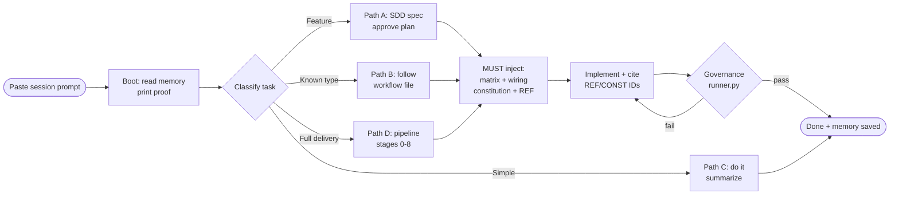
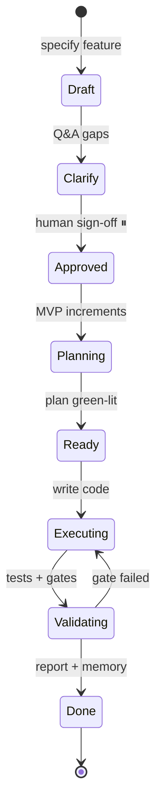
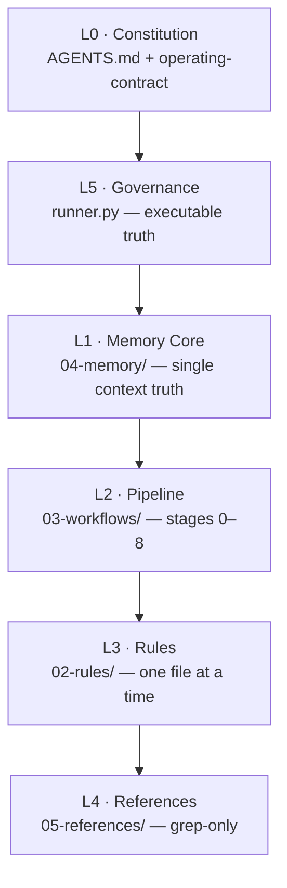

# My Programming Workflow — Agent Operating System (AOS) v7.0

[](https://github.com/Nezarabdluah/My-Programming-Workflow)
[](https://github.com/Nezarabdluah/My-Programming-Workflow)
[](https://github.com/Nezarabdluah/My-Programming-Workflow)
[](https://github.com/Nezarabdluah/My-Programming-Workflow)

> **A stack-agnostic operating system that turns any AI coding assistant into a governed engineering team** — every task classified, every stage injected with the right knowledge, every delivery verified. Copy one folder, paste one prompt, ship with proof.

## ✨ Why AOS?

| Free-form prompting ❌ | AOS ✅ |
|---|---|
| The model *knows* good practice but never applies it | **Mandatory injection** — every workflow starts `MUST, gate blocked`; no stage closes without a Resource Utilization Summary |
| Knowledge scattered across chats | **Wiring Registry** — one DI container mapping each capability → rule file → REF contracts → constitution |
| 16 books of wisdom, zero enforcement | **6 constitutions (79 rules)** + **34-directive REF catalog** + **114-lesson archive**, all cited by ID in code |
| Context dies between sessions/tools | **Cumulative memory** + handoff protocol — the next tool resumes mid-sentence |
| "Done" = "it compiles" | **Vertical-slice governance** — 7 layers covered or justified in writing |
| Contradicting guidance everywhere | **Layer priority L0→L5** — Security > Memory > Correctness > Simplicity > Performance > Conventions |

## 🚀 Quick Start (3 steps)

```bash
# 1. Clone the master (read-only source)
git clone https://github.com/Nezarabdluah/My-Programming-Workflow.git
# 2. Copy .agent/ into YOUR project, init memory per .agent/03-workflows/init-project.md
# 3. Paste the session prompt (Section: Session Prompt ⬇) as your first AI message
```

> ✅ Done — the agent prints a **boot report** (proof it read memory) and asks for the first task.

## 🗺️ Table of Contents

- [How a Task Flows](#-how-a-task-flows)
- [Architecture](#architecture)
- [Step-by-Step Daily Workflow](#-step-by-step-daily-workflow)
- [The Session Prompt (copy-paste)](#-the-session-prompt-copy-paste)
- [Core Concepts](#-core-concepts)
- [Repository Map](#repository-map)
- [Reference Library](#-reference-library)
- [Governance Gate](#-governance-gate)
- [Switching AI Tools](#-switching-ai-tools-mid-project)
- [Keeping Projects in Sync](#-keeping-projects-in-sync)
- [FAQ](#-faq)
- [Contributing](#-contributing)

## 🔄 How a Task Flows





## 🏗️ Architecture



**Dependency flow is strictly one-way** (Workflows → Memory → References → Rules). Workflows never embed quality rules; rules never know their consumers. The injection matrix maps **20/20 resources** to every stage (`MUST` = gate blocked, `SHOULD`, `IF`).

## 👣 Step-by-Step Daily Workflow

1. **Open a session** — paste the prompt ⬇, confirm the boot report (project, stack, memory quotes, VERSION sync).
2. **State the task** — e.g. *"Add order refunds to the billing module."*
3. **Confirm classification** — agent proposes 🟢/🟡/🔴; correct it if wrong (corrections are learned as Type A/B/C).
4. **Review spec & plan** (🟡/🔴) — user stories with `Given/When/Then` or EARS acceptance, then MVP increments. **Approve explicitly — zero code before this.**
5. **Watch injection** — matrix row → wiring row → constitution(s) → one rule file → prompt packs, all cited (`// [REF-DB-N1]`, `// [CONST-SEC-3]`).
6. **Review the slice report** — coverage table (`[Layer] ← [done / n/a because…]` + `file:line`), decisions (choice ← rejected alternative ← principle), judgment calls, human-review flags.
7. **Validate** — project tests green + `governance/runner.py`, declaring `[Enforcement: CI ✅ / hooks ⚠️ / runner.py 🔶 / manual 🔶]` (`[claim ❌]` is rejected).
8. **Close or hand off** — *"end session"* or *"switch tool"*; memory saved, summary printed.

## 📋 The Session Prompt (copy-paste)

> Replace `[YOUR-LOCAL-AOS-PATH]` with your clone's `.agent` folder (e.g. `C:\AOS\My-Programming-Workflow\.agent`). Set the chat language in line 2 as you like.

<details>
<summary><b>Click to expand the full session prompt</b></summary>

```text
You operate on an integrated system: AOS v7.0 + Spec-Kit (SDD) — Knowledge-first & Memory-first Platform.
Communicate in clear, professional English. Think aloud in a structured, rigorous way before every decision.
Main AOS source (READ-ONLY): [YOUR-LOCAL-AOS-PATH]

SOURCE PROTECTION: never modify or write to the Main AOS Path. All writes happen in the current project's local .agent/04-memory/ only.

STEP 0 — BOOT & MATCH (silent, then report):
1. If the current project has no .agent/ folder → initialize it by fully executing [YOUR-LOCAL-AOS-PATH]/03-workflows/init-project.md (copy system + init 04-memory/ + stamp VERSION with source_path [YOUR-LOCAL-AOS-PATH]).
2. If .agent/ exists → diff 01-core/, 02-rules/, 03-workflows/, 04-memory/, 05-references/, governance/ against the main source; copy any missing file so the structure is 100% complete.
3. If the project already contains code → also execute .agent/03-workflows/knowledge-bootstrapping.md.

SESSION MODE (budget ≤ 400 lines). Read in order:
1. .agent/INDEX.md  2. .agent/01-core/operating-contract.md  3. .agent/04-memory/project-context.md
4. .agent/04-memory/learned-mistakes.md  5. .agent/04-memory/active-tasks.md  6. .agent/VERSION

Then print this boot report:
  Session started | System: AOS v7.0 (Knowledge & Memory-first)
  Project: [name] | Stack: [detected: package.json / requirements.txt / csproj|sln / General]
  Memory — project-context: "[last task verbatim or 'new project']"
  Memory — learned-mistakes: [N] active, latest: "[quote or 'none']"
  Memory — active-tasks: [N] pending, top: "[quote or 'none']"
  VERSION: [in sync ✅ / needs sync ⚠️]
  Ready — what is our next task?

TASK ROUTING:
- Path A (new feature / big change: "add", "rebuild", "create system", "change architecture") → classify 🟢/🟡/🔴, apply the Policy Engine (🔴 = ADR + OWASP/SARGable + human gate; 🟡 = Clean Code + local tests green), then SDD: Draft → Clarify → Approved → Planning → Ready → Executing → Validating → Done. STOP at the Approval Gate before writing code.
- Path B (matches .agent/03-workflows/: backend module, frontend module, bug, UX, mobile-qa, security-gate, requirements, QA, production-readiness) → read that file and follow it exactly, including its MUST injection block.
- Path C (trivial: text, color, comment) → 🟢 do it, summarize.
- Path D (full delivery) → run 03-workflows/master-pipeline/ stages 0–8 with decision gates (DoD: 🟢 mini / 🟡 stages 1,4,5 / 🔴 all 0–8).

SMART WIRING (before code): resolve via .agent/01-core/wiring-registry.md + .agent/05-references/books/00-master-index.md (20/20 resources mapped); load the ONE matching 02-rules/ file; grep (never full-read) 05-references/ including the 114-lesson books archive by lesson number/keyword when deep rationale is needed; ABP project → also inject 06-templates/dotnet-abp/prompts.md alongside backend-prompts; cite as // [REF-XX-N] and // [CONST-XX-N]; end each stage with a Resource Utilization Summary.

HANDOFF (on "switch tool" / "save session"): update active-tasks.md + project-context.md + decisions.md, then print a handoff summary (project, current feature, exact stopping point, next step).
CLOSEOUT (on "end session"): execute .agent/03-workflows/end-session.md, update all memory files, print the session summary.

FORBIDDEN: writing to the main AOS source · loading two rule files at once · full-reading 05-references/ · skipping classification · coding 🟡/🔴 without approved spec+plan · ending a 🟡/🔴 reply without updating memory · accepting assumptions — test-tool success is the only proof of code quality.
```

</details>

## 🧠 Core Concepts

| Class | Signals | Process |
|---|---|---|
| 🟢 Simple | typo, color, comment (≤2 files) | YAGNI — execute, summarize |
| 🟡 Medium | business logic, multi-file | Clean Code + SDD + tests green |
| 🔴 Sensitive | DB, auth, architecture (>5 files) | ADR + OWASP/SARGable + human gate |

Zero-Trust: in doubt, escalate. Never downgrade 🟡/🔴. Budgets: ≤400 lines/session · one rule file at a time · mistakes capped at 20 (3rd repeat → permanent rule).

## 🗂️ Repository Map

```
.agent/
├── AGENTS.md · INDEX.md · VERSION
├── 01-core/        contract · session-prompt · classification · budget · collaboration · ⭐wiring-registry
├── 02-rules/        architecture · database · security · testing · network · vertical-slice
├── 03-workflows/   init/start/end · requirements · backend/frontend · debug · UX
│                   bootstrapping · qa-strategy · production-readiness
│                   ⭐master-pipeline/ (stages 0–8) · mobile-qa/ · security-gate/ (7 steps)
├── 04-memory/      context · active-tasks · decisions · learned-mistakes (+knowledge/map/archive)
├── 05-references/  REF catalog (34) · ⭐injection matrix (20/20) · 6 constitutions (79 rules)
│                   114-lesson archive (EN, grep Lesson N) · prompts · QA[11]/OPS[18] anchors
├── 06-templates/   dotnet-abp/ (entity, standards, persona, prompts, PR, hooks, CI gate)
│                   claude-skills/ (official clone, reference-only → submodule, see FAQ)
└── governance/     runner.py + 3 test files · 10 checks · EN (GOV-T01…T11) + adr/ template
AGENTS.md · .gitignore · .cursorrules · .windsurfrules (IDE shims → .agent/)
```

## 📚 Reference Library

| Resource | What the agent pulls |
|---|---|
| REF catalog | 34 directives: ARCH·DB·SEC·NET·TEST·OBS·RES·AI |
| Constitutions | 79 actionable rules: arch, DDD, security, perf, resilience, integration |
| Books archive | 114 English lessons — grep `Lesson N`, stages 2+4 `IF deep-design` |
| Prompt packs | backend / frontend / debugging (+ ABP snippets) |
| QA / DevOps | 11 `[QA-*]` anchors (Playwright·Newman·k6) · 18 `[OPS-*]` anchors (CI·SLO·rollback) |
| ABP templates | entity pattern (`private set` law), standards, persona, PR template, pre-commit, CI gate |

## 🛡️ Governance Gate

```bash
python .agent/governance/runner.py
```

Executable ground truth — 10 checks over memory, rules, and state. `end-session.md` enforces it **before Done** (GOV-T11: exit codes and tool output count; model claims don't).

## 🔀 Switching AI Tools Mid-Project

1. Say **"switch tool"** — memory files update, handoff summary prints.
2. In the new tool, paste the [session prompt](#-the-session-prompt-copy-paste) **plus** the handoff summary.
3. Work resumes at the exact stopping point. No re-explaining.

## 🔄 Keeping Projects in Sync

`VERSION` records `aos_version` + `last_sync` + `source_path`. Upgrade = pull repo → re-run Step-0 diff → copy deltas → bump `last_sync`. Project learning stays in project memory; universal improvements graduate to `02-rules/` by review.

## ❓ FAQ

**Which AI tools work?** Any assistant reading local files: Claude, Cursor, Windsurf, Copilot, Antigravity… shims point them at `.agent/`; root `AGENTS.md` is auto-discovered by ~30 tools.

**Which stack?** None forced. Only `06-templates/` is .NET/ABP-specific and loads conditionally.

**Really 100% English?** Audited zero-Arabic repo-wide. Chat language is yours — change line 2 of the prompt freely.

**Cost per task?** Boot ≤400 lines; one rule file at a time; references are grepped, never dumped.

**Secrets/paths?** Never in repo. `[YOUR-LOCAL-AOS-PATH]` lives in your chat only.

**The bundled Claude skills?** Pristine `anthropics/skills` clone (17 skills), reference-only, never indexed. Track as submodule: `git submodule add https://github.com/anthropics/skills.git .agent/06-templates/claude-skills`, then drop the ignore line; clone with `--recurse-submodules`.

## 🤝 Contributing

Issues and PRs welcome at [Nezarabdluah/My-Programming-Workflow](https://github.com/Nezarabdluah/My-Programming-Workflow). `01-core/` and `02-rules/` need extra-careful review — every project inherits them. Shorter files get followed more reliably: prune ruthlessly.
